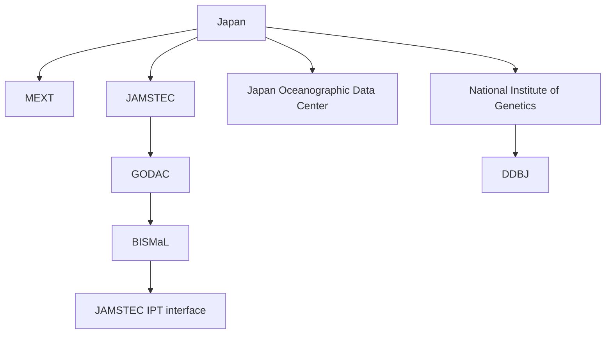
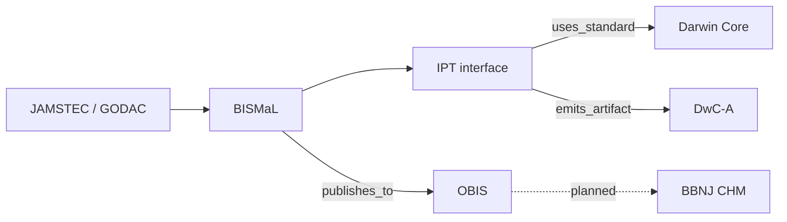
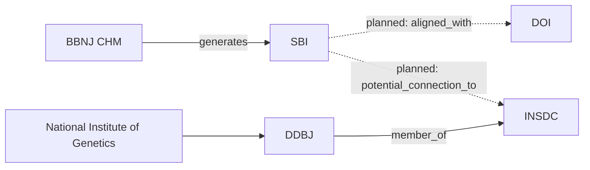
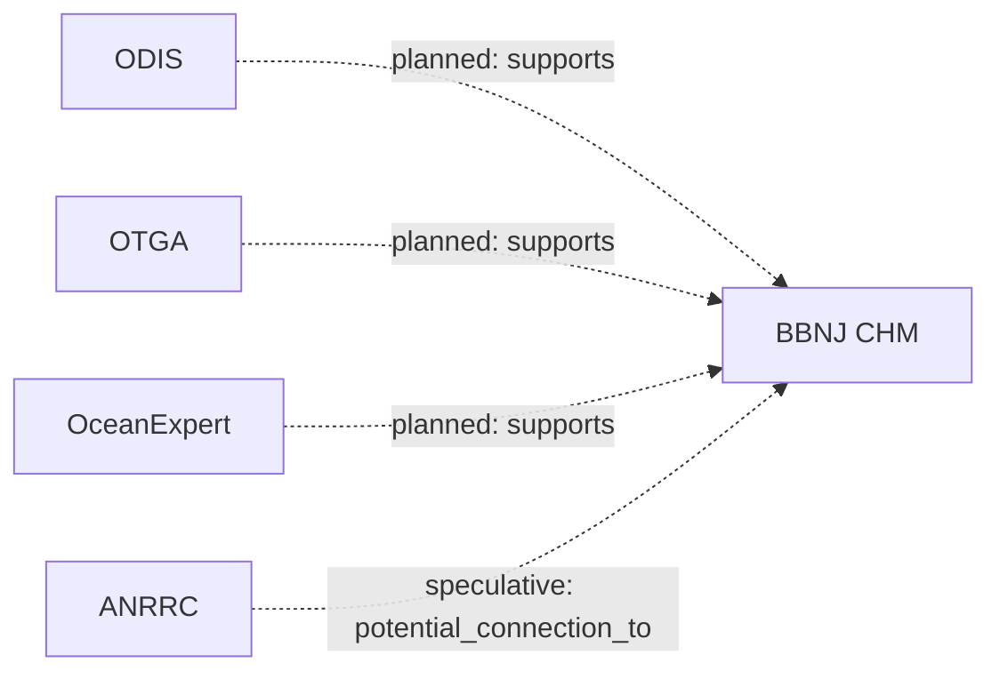

# Japan Seed Diagrams

This file breaks the Japan seed into smaller views so it is easier to read than the single all-in-one chat diagram.

## 1. Japan Hierarchy

## 2. Biodiversity Publishing Path

## 3. Identifier And Sequence Path

## 4. CHM Support Systems

## Notes

- `solid arrows` are active/current seed relationships
- `dotted arrows` are planned or speculative CHM-facing relationships
- `SBI` means `Standardized Batch Identifier`
